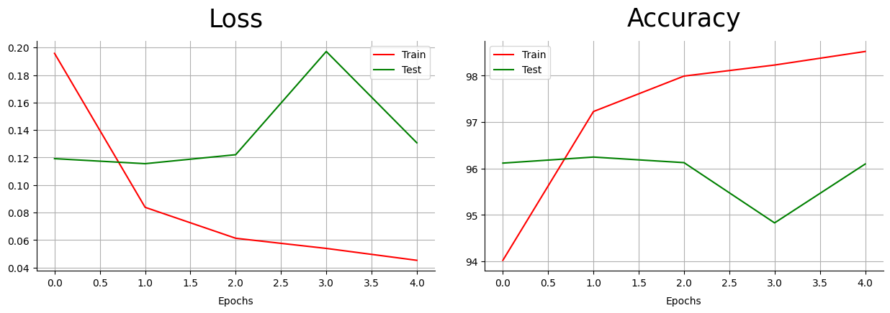

# QA System and Vision Transformer

Two independent pieces of work in one repository: extractive question answering
over Persian text, and CIFAR-10 image classification comparing a distilled vision
transformer against a fine-tuned convolutional network.



## Requirements

Python 3.10 or later. CIFAR-10 downloads automatically through torchvision on
first use. A CUDA or Apple Silicon device is strongly recommended for training;
the device is selected automatically.

## Installation

```bash
pip install -e .
```

With the test suite:

```bash
pip install -e ".[dev]"
```

## Usage

Train a classifier on CIFAR-10:

```python
import torch
from vision import build_deit, cifar10_loaders, fit

train_loader, test_loader = cifar10_loaders(batch_size=32)
model = build_deit()
optimizer = torch.optim.Adam(model.parameters(), lr=1e-4)
history = fit(model, train_loader, test_loader, epochs=5, optimizer=optimizer)
```

Swap `build_deit()` for `build_vgg19()` to run the convolutional baseline.

Score question answering predictions:

```python
from qa_system import score

score(["تهران"], [["تهران", "شهر تهران"]])
```

## Results

### Question answering

Two pretrained encoders fine-tuned on the same data and scored the same way.

| model | exact match | token F1 |
| --- | --- | --- |
| ALBERT (Persian) | 69.2% | 76.2% |
| ParsBERT | 67.8% | 74.4% |

ALBERT leads by 1.4 points on exact match and 1.8 on F1, a real but narrow gap,
and worth reading alongside the fact that ALBERT is the much smaller model. Its
parameter sharing across layers makes it cheaper to fine-tune and serve for
slightly better accuracy here.

The distance between exact match and F1 is the more interesting figure. Roughly
seven points of F1 sit above exact match, so a substantial share of answers
overlap the gold span without matching it exactly: the model finds the right
region of the passage and takes slightly too much or too little of it.

### CIFAR-10 classification

| model | best test accuracy | minutes per epoch |
| --- | --- | --- |
| DeiT-Base distilled | 96.2% | 26.5 |
| VGG19, one block unfrozen | 91.8% | 5.1 |
| VGG19, backbone unfrozen | 87.6% | 5.1 |

The transformer wins by 4.4 points over the better VGG19 for roughly five times
the compute per epoch. Whether that trade is worth making depends on what the
accuracy is for.

The third row is the instructive one. Leaving the entire feature extractor
trainable reaches 100% training accuracy and 87.6% test, four points worse than
freezing all but one block. On a dataset this small, fine-tuning more of a
pretrained network overfits rather than helping.

Training curves are in `docs/`.

## Scoring

`qa_system.metrics` implements the SQuAD scorer with the normalisation Persian
requires. Arabic and Persian letterforms that render identically but differ in
code point (`ي` against `ی`, `ك` against `ک`) are unified, zero-width
non-joiners become spaces, and combining diacritics are stripped. Without that, a
correct answer fails on spelling alone. Both metrics take the best score over the
set of acceptable answers, so a question with several valid spans is not
penalised for picking one.

## Project structure

```
qa_system/
    metrics.py    SQuAD exact match and token F1 with Persian normalisation
vision/
    data.py       CIFAR-10 loaders and transforms
    models.py     DeiT and VGG19 builders
    training.py   train and evaluation loops, device selection
tests/            metric tests and model wiring tests
docs/             figures referenced by this README
pyproject.toml    dependencies
```

## Components

| module | responsibility |
| --- | --- |
| `qa_system.metrics` | Text normalisation, exact match, token F1, corpus scoring |
| `vision.data` | Dataset loaders and the resize/augment/normalise pipeline |
| `vision.models` | Backbone construction and parameter freezing |
| `vision.training` | Epoch loop, history recording, device selection |

## Testing

```bash
python -m pytest tests/
```

Fourteen tests. The metric tests are exhaustive and run instantly. The vision
tests build the networks without pretrained weights, so nothing is downloaded.
